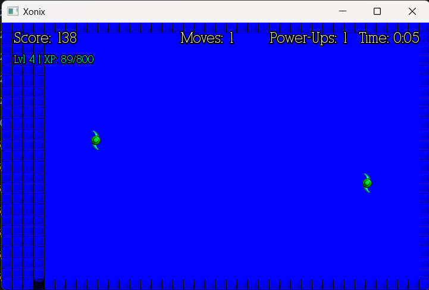
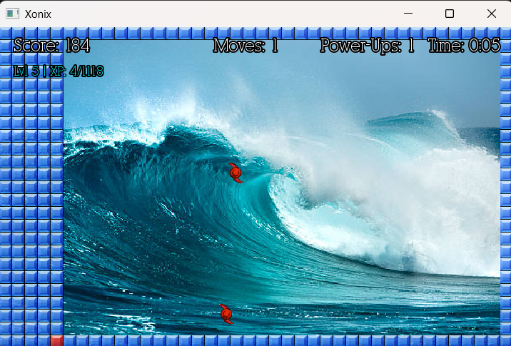
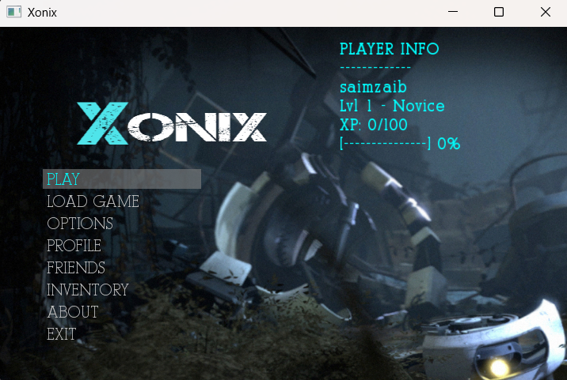
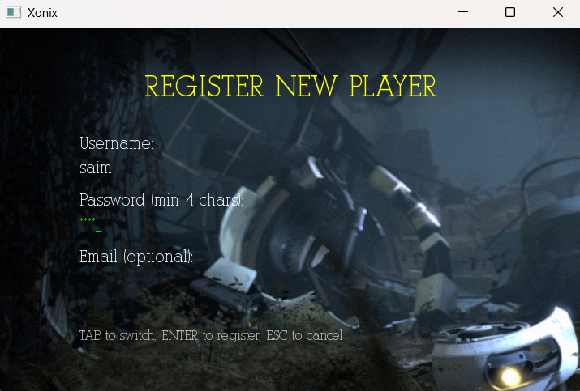
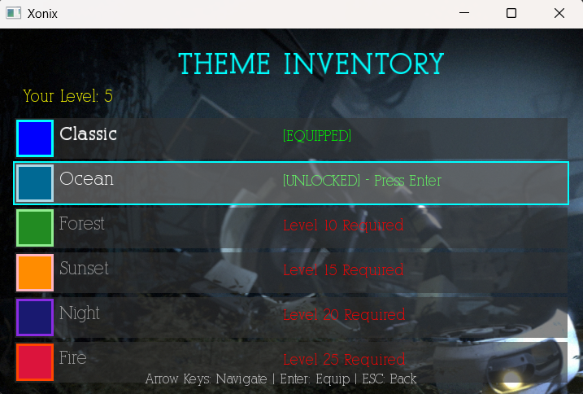
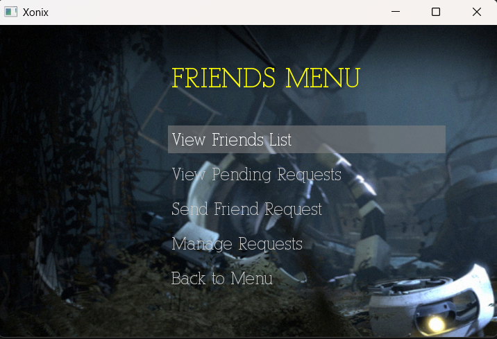

# 🛡️ Secure Xonix

**Secure Xonix** is a secure, feature-rich recreation of the classic arcade strategy game built entirely from scratch in **C++ with SFML**.

This project is not just a game clone — it is a **Systems Programming + Secure Software Engineering** demonstration.  
It showcases how **Data Structures, Memory Safety, File Security, and Controlled Resource Management** can be applied in a real interactive application.

The architecture emphasizes **secure memory handling**, **safe file operations**, **custom data structures**, and **defensive programming practices** throughout the codebase.

---

## 📸 Screenshots

### 🎮 Gameplay

| Classic Mode | Ocean Theme (Unlockable) |
| --- | --- |
|  |  |

---

### 🖥️ Systems & UI

| Main Menu | Authentication |
| --- | --- |
|  |  |

| Inventory (AVL Tree) | Social Hub (Hash Table) |
| --- | --- |
|  |  |

---

## 🚀 Core Features

- Territory capture gameplay with intelligent enemy AI
- Secure Login & Registration system
- Player progression with XP and unlockable themes
- Inventory management using AVL Trees
- Friend system using custom Hash Tables
- Persistent save/load game state using file serialization
- Global Top-10 leaderboard using Min-Heap
- Local 2-player mode

---

## 🔐 Security-Focused Engineering

Secure Xonix was designed with **security-first programming principles**.

### 🧠 Secure Memory Management

- Careful use of **pointers and dynamic memory**
- Proper destructors to prevent **memory leaks**
- Avoidance of dangling pointers
- Controlled object lifetimes
- Minimal reliance on STL containers to understand memory behavior
- Stack vs Heap allocation decisions based on safety

### 📁 Safe File Handling (Serialization)

- Sanitized input/output when reading player data
- Controlled file paths to prevent path traversal
- Structured serialization format for save/load states
- Defensive checks before reading from files
- Prevention of corrupted game states

### 🔑 Authentication System

- Structured user records
- Validation checks during login/registration
- Prevention of duplicate users
- Safe string handling to avoid buffer issues

### 🛡️ Defensive Programming

- Boundary checks on grid movement
- Input validation for menus and controls
- Controlled recursion in Flood Fill to avoid stack overflow
- Safe collision handling in Hash Tables
- Balanced tree rotations in AVL to prevent degeneration

---

## 🧩 Data Structures Used (Custom Implementations)

| Data Structure | File | Purpose | Complexity |
| --- | --- | --- | --- |
| AVL Tree | `Inventory.cpp` | Theme inventory management | O(log n) |
| Hash Table (Linear Probing) | `FriendSystem.cpp` | Friend list & user lookup | O(1) avg |
| Min Heap | `MinHeap.cpp` | Leaderboard Top-10 | O(log n) |
| Flood Fill (DFS) | `main.cpp` | Territory capture logic | O(n) |

These are implemented manually to demonstrate **algorithmic control, memory handling, and performance awareness**.

---

## 🛠️ Installation & Build

### Prerequisites

- C++ Compiler (G++ / MinGW / MSVC)
- SFML 2.5+

### Clone

```bash
git clone https://github.com/saimcyber/Secure-Xonix.git
cd Secure-Xonix
```

### Build with CMake

```bash
cmake -S . -B build
cmake --build build
./build/xonix          # build/xonix.exe on Windows
```

### Build without CMake (Windows + MinGW)

```bat
buildandrun.bat
```

Edit `SFML_DIR` in `buildandrun.bat` (or `SFML_DIR` in `CMakeLists.txt`) if your
SFML install is not at `C:\SFML`. Assets and the required SFML DLLs are copied
next to the executable automatically.

## Project Structure

```text
src/
  main.cpp            game loop, grid, flood-fill territory capture
  Menu.cpp            menus and navigation
  Authentication.cpp  login / registration
  Profile.cpp         player profile, XP, unlocks
  Inventory.cpp       AVL tree — theme inventory
  FriendSystem.cpp    hash table — friends and lookup
  MinHeap.cpp         min-heap — Top-10 leaderboard
  PriorityQueue.cpp / GameRoomQueue.cpp   matchmaking queue
  SaveGame.cpp        file serialization of game state
assets/               fonts, images, audio, screenshots
CMakeLists.txt        CMake build
buildandrun.bat       direct g++ build for Windows
```

## Authors

Muhammad Amish and Saim Zaib — a Data Structures course project.

## License

MIT — see [LICENSE](LICENSE).
